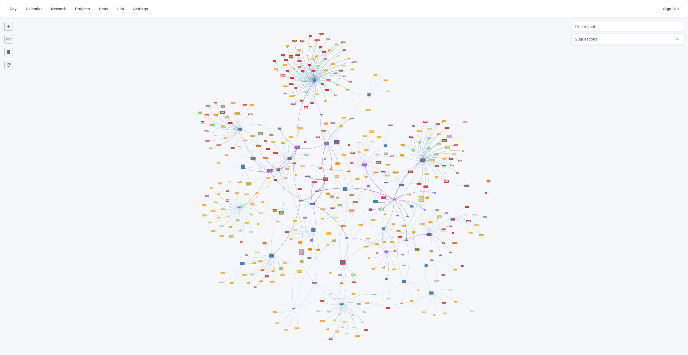
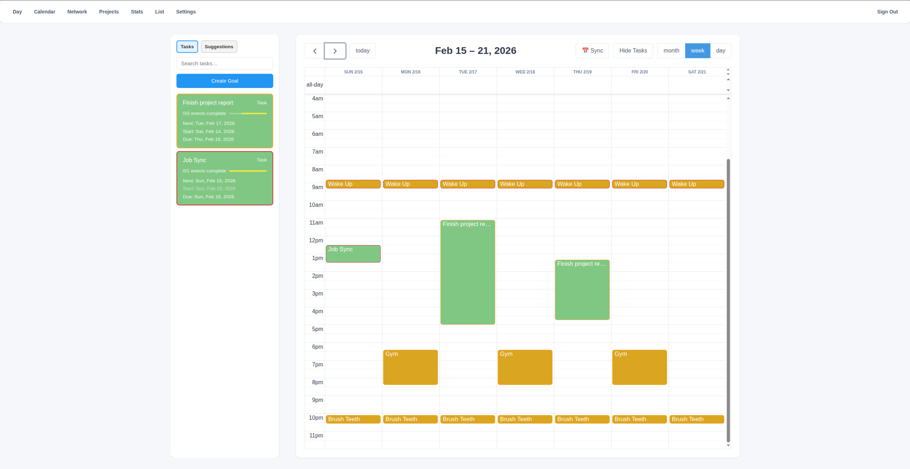
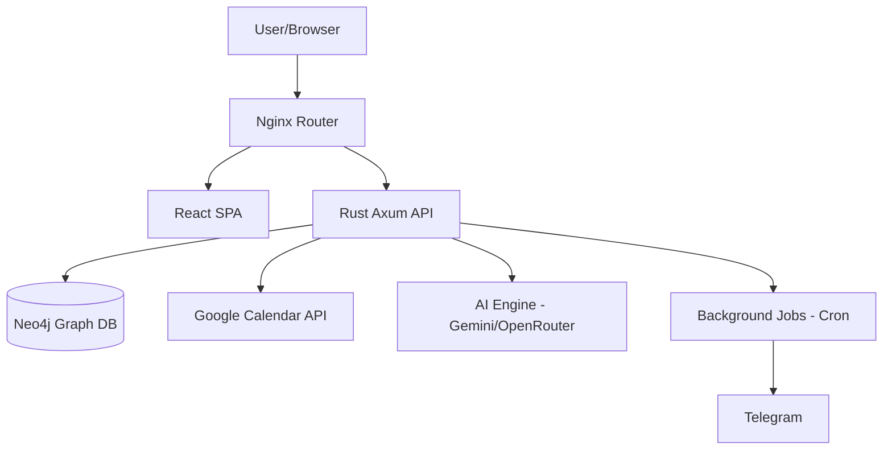

# Goals

A sophisticated goal management system with graph-based visualization, temporal scheduling, and automated routine generation.


*Visualizing goal relationships and hierarchies.*


*Unified scheduling for tasks, routines, and Google Calendar events.*

## Overview

The Goals system is designed to bridge the gap between long-term vision and daily execution. By representing goals as a directed graph, users can see exactly how their daily tasks contribute to high-level life directives.

### Key Features

- **Graph-Based Hierarchy**: Link goals in complex parent-child relationships (Directives → Projects → Achievements → Tasks).
- **Network Visualization**: Interactive graph view using `vis-network` to explore and manage goal dependencies.
- **Unified Calendar**: Merges singular tasks, automated routines, and bidirectional Google Calendar sync.
- **Intelligent Routines**: Automated event generation (up to 6 months) with flexible recurrence patterns.
- **Ecosystem Integration**: Telegram bot integration, and AI-powered suggestions via OpenRouter/Gemini.

## Tech Stack

- **Backend**: Rust ([Axum](https://github.com/tokio-rs/axum)) - High-performance, type-safe API.
- **Frontend**: React 18, TypeScript, [Material-UI](https://mui.com/) - Modern and responsive UI.
- **Database**: [Neo4j](https://neo4j.com/) - Graph database for complex relationship mapping.
- **Infrastructure**: Docker Compose, Nginx (Router), Cloudflare Tunnel.

## Architecture



## Getting Started

### Prerequisites

- Docker & Docker Compose
- Node.js 18+
- Rust (latest stable)

### Installation

1. **Clone the repository:**
   ```bash
   git clone https://github.com/your-repo/goals.git
   cd goals
   ```

2. **Run the setup script:**
   ```bash
   ./scripts/setup.sh
   ```

3. **Start the development environment:**
   ```bash
   ./scripts/manage-compose.sh dev
   ```

The application will be available at:
- **Frontend**: http://localhost:3030
- **Backend**: http://localhost:5059
- **Neo4j**: http://localhost:7474

## Project Structure

- `backend/`: Rust source code and API implementation.
- `frontend/`: React source code and UI components.
- `db/`: Database initialization and backup scripts.
- `router/`: Nginx configuration for unifying the stack.
- `docs/`: Technical documentation and assets.
- `scripts/`: Utility scripts for environment management and testing.
- `ops/`: Monitoring and operational scripts.

## Deployment

The system is deployed on a **bare metal Linux server** using a Docker-based architecture for maximum reliability and ease of updates.

### CI/CD Pipeline

Deployments are fully automated through **GitHub Actions**:
- **Triggers**: A push to the `prod` branch or a manual trigger starts the deployment.
- **Pre-deploy Safety**: The pipeline automatically takes a backup of the Neo4j database before any changes are applied.
- **Build & Deploy**: The production stack is built from source using `docker-compose.prod.yaml` on a self-hosted runner.
- **Monitoring Integration**: The deployment process ensures the custom monitoring daemon is updated and running.

### Monitoring & Health

A custom Python-based monitoring service (`ops/monitor/goals_monitor.py`) runs in the background to ensure high availability:
- **Proactive Probing**: Checks frontend and backend health every 60 seconds.
- **Resource Tracking**: Monitors CPU, memory, and disk usage on the host.
- **Instant Alerts**: Sends downtime notifications immediately via a **Telegram Bot**.
- **Performance Summaries**: Delivers a daily uptime and latency report to stay on top of system performance.

## Testing

The project maintains a comprehensive testing suite covering both backend logic and frontend user flows.

### Test Runner
A unified test runner is provided to manage the environment and execute all tests:
```bash
./scripts/run-tests.sh
```
This script automates the creation of a clean test stack (Docker), builds the services, waits for health checks, and runs both backend and frontend suites.

### Backend Integration Tests
Located in `backend/tests/`, these tests validate:
- **Routine Generation**: Complex recurrence logic and event creation patterns.
- **Database Integrity**: Graph relationship creation and constraints.
- **Neo4j Interaction**: Real database tests using a dedicated test container.

### Frontend E2E Tests
Located in `frontend/tests/`, using **Playwright**:
- **Critical Paths**: Calendar interactions, goal creation, and list management.
- **Parallel Execution**: A custom parallel environment (`scripts/start-parallel-test-env.sh`) allows running tests across multiple isolated worker containers to minimize CI time.
- **Auth Simulation**: Shared global setup for consistent authentication state across test workers.

### Specialized Testing
- **Timezone Testing**: Dedicated guides and tests (`docs/development/timezone-testing.md`) to ensure consistent behavior across different system timezones and DST transitions.
- **CI/CD Validation**: GitHub Actions (`test-integration-e2e.yml`) automatically runs the full suite on every Pull Request.

---
