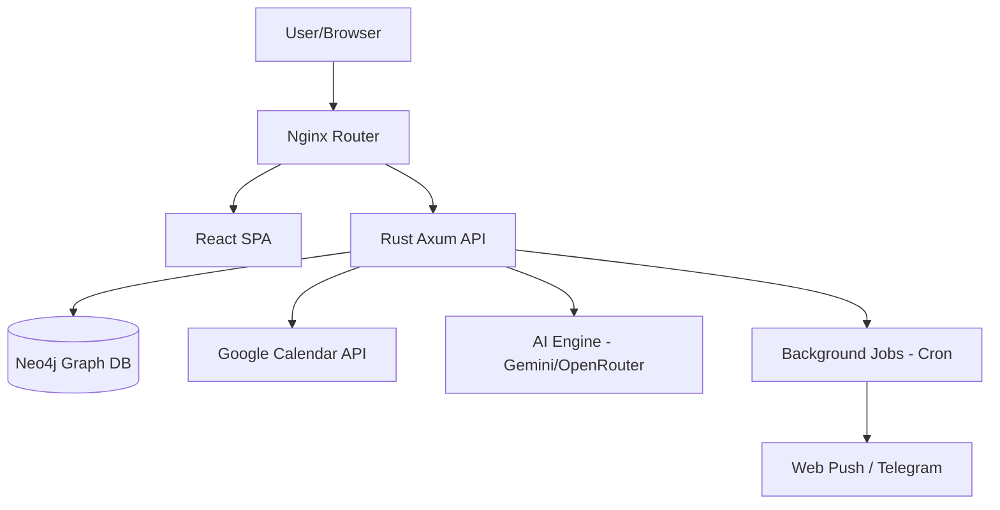

# Goals

A sophisticated goal management system with graph-based visualization, temporal scheduling, and automated routine generation.


*Visualizing goal relationships and hierarchies.*


*Unified scheduling for tasks, routines, and Google Calendar events.*

## 🚀 Overview

The Goals system is designed to bridge the gap between long-term vision and daily execution. By representing goals as a directed graph, users can see exactly how their daily tasks contribute to high-level life directives.

### Key Features

- **Graph-Based Hierarchy**: Link goals in complex parent-child relationships (Directives → Projects → Achievements → Tasks).
- **Network Visualization**: Interactive graph view using `vis-network` to explore and manage goal dependencies.
- **Unified Calendar**: Merges singular tasks, automated routines, and bidirectional Google Calendar sync.
- **Intelligent Routines**: Automated event generation (up to 6 months) with flexible recurrence patterns.
- **Ecosystem Integration**: Web Push notifications, Telegram bot integration, and AI-powered suggestions via OpenRouter/Gemini.

## 🛠 Tech Stack

- **Backend**: Rust ([Axum](https://github.com/tokio-rs/axum)) - High-performance, type-safe API.
- **Frontend**: React 18, TypeScript, [Material-UI](https://mui.com/) - Modern and responsive UI.
- **Database**: [Neo4j](https://neo4j.com/) - Graph database for complex relationship mapping.
- **Infrastructure**: Docker Compose, Nginx (Router), Cloudflare Tunnel.

## 🏗 Architecture



## 🚦 Getting Started

### Prerequisites

- Docker & Docker Compose
- Node.js 18+
- Rust (latest stable)

### Installation

1. **Clone the repository:**
   ```bash
   git clone https://github.com/your-repo/goals.git
   cd goals
   ```

2. **Run the setup script:**
   ```bash
   ./scripts/setup.sh
   ```

3. **Configure environment:**
   Copy `backend/vapid.env.example` to `backend/vapid.env` and fill in your secrets.

4. **Start the development environment:**
   ```bash
   ./scripts/manage-compose.sh dev
   ```

The application will be available at:
- **Frontend**: http://localhost:3030
- **Backend**: http://localhost:5059
- **Neo4j**: http://localhost:7474

## 📂 Project Structure

- `backend/`: Rust source code and API implementation.
- `frontend/`: React source code and UI components.
- `db/`: Database initialization and backup scripts.
- `router/`: Nginx configuration for unifying the stack.
- `docs/`: Technical documentation and assets.
- `scripts/`: Utility scripts for environment management and testing.

---

## 🧪 Testing

Run the full test suite (Integration + E2E):
```bash
./scripts/run-tests.sh
```

For more details on timezone testing, see [Timezone Testing Guide](docs/development/timezone-testing.md).
