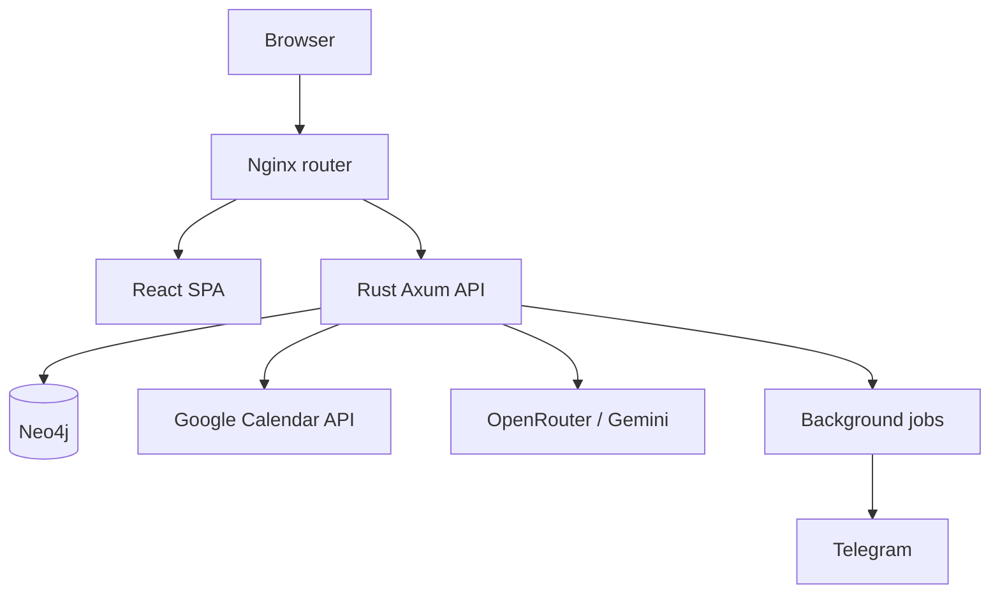

# Goal Architecture Platform

[](https://github.com/Andrew50/goals/actions/workflows/pr-verify.yml)

Goal Architecture Platform is a self-hosted goal planning and scheduling application I use daily to manage 10K+ goals and tasks. A React/TypeScript frontend and Rust/Axum API model goal hierarchies in Neo4j and support automated scheduling, recurring routines, analytics, and optional Google Calendar sync.


## Overview

Goals are modeled as a directed graph. Directives, projects, achievements, tasks, and routines are nodes linked by parent/child relationships. The React UI exposes day, calendar, network, projects, stats, and list views on that model.

The graph model keeps arbitrary-depth relationships between those types explicit, which makes hierarchy traversal and aggregate progress easier than flattening everything into conventional task lists.

The Rust/Axum backend talks to Neo4j. Background jobs materialize routine events on a rolling ~6-month horizon, sync Google Calendar when enabled, and send Telegram notifications. Optional AI autofill goes through OpenRouter (with Gemini available for related query paths).

The application is self-hosted with Docker Compose and Nginx, with GitHub Actions handling testing and deployment from a self-hosted runner.

## Highlights

- Graph data model in Neo4j with interactive `vis-network` exploration and hierarchy traversal APIs
- Routine engine that materializes recurring events over a rolling horizon, with exception handling and timezone-aware scheduling
- Bidirectional Google Calendar sync plus JWT auth (email/password and Google OAuth)
- Playwright E2E and Jest unit testing with parallel test stacks and coverage-gated PR CI
- Docker Compose / Nginx deployment with Neo4j backup before deploy and a Python health monitor that alerts via Telegram

## Architecture


```mermaid
graph TD
    Browser --> Nginx[Nginx router]
    Nginx --> Frontend[React SPA]
    Nginx --> Backend[Rust Axum API]
    Backend --> Neo4j[(Neo4j)]
    Backend --> GCal[Google Calendar API]
    Backend --> AI[OpenRouter / Gemini]
    Backend --> Jobs[Background jobs]
    Jobs --> Telegram[Telegram]
```

**Stack:** React 18, TypeScript, MUI, FullCalendar, vis-network · Rust, Axum, neo4rs · Neo4j · Docker Compose · Nginx · GitHub Actions (self-hosted)

## Design

### Why a graph?

Goals nest at arbitrary depth: a directive can own projects, which own achievements, tasks, and routines. Storing those links as first-class relationships in Neo4j matches how the product is used—walk the hierarchy, render the network view, and roll progress up through parents—without forcing a single flat task table or hard-coded nesting levels.

### Recurring routines

Routines are definitions (frequency, time-of-day, optional end) rather than one-off calendar rows. A background job expands each routine into concrete event nodes out to a ~6-month horizon, skips recorded exceptions, and regenerates when the definition changes. Scheduling is timezone-aware so occurrence boundaries stay consistent across DST and client locales.

## Running locally

**Requirements:** Docker and Docker Compose. Node 22 (see `.nvmrc`) and Rust are only needed outside containers.

```bash
git clone https://github.com/Andrew50/goals.git
cd goals
cp .env.example .env   # set JWT_SECRET; add Google/AI keys if needed
./scripts/manage-compose.sh dev
```

| Service  | URL |
|----------|-----|
| Frontend | http://localhost:3030 |
| Backend  | http://localhost:5059 |
| Neo4j    | http://localhost:7474 |

Stop with `./scripts/manage-compose.sh down`.

## Tests

```bash
./scripts/run-tests.sh                 # test Compose stack, then backend + frontend suites
./scripts/run-tests.sh --skip-frontend # backend integration only
cd frontend && npm test                # Jest unit tests
```

PR CI (`.github/workflows/pr-verify.yml`) runs Rust `cargo test --lib`, frontend Jest with a coverage gate, and related checks on a self-hosted runner. Routine integration/E2E runs in `.github/workflows/test-integration-e2e.yml`.

## Deployment

Production runs on a bare-metal Linux host using `docker-compose.prod.yaml`. Pushes to `prod` (or a manual workflow run) trigger GitHub Actions on a self-hosted runner, which backs up Neo4j, rebuilds the application, and restarts the stack. A lightweight Python monitor checks frontend and API health and sends Telegram alerts on failures.

## Project status

**Status:** Active personal production system.
