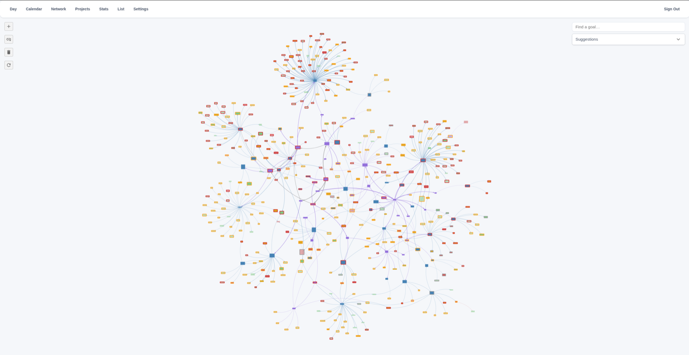
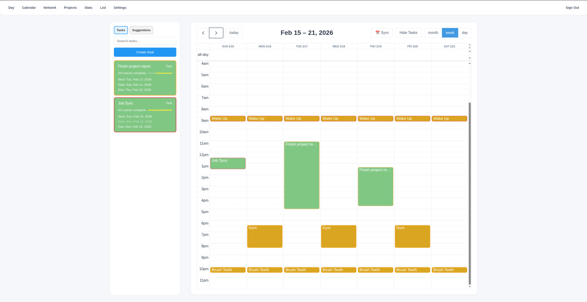
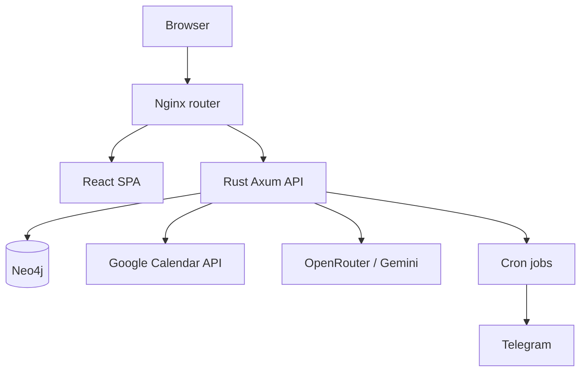

# Goals

[](https://github.com/Andrew50/goals/actions/workflows/pr-verify.yml)

Personal goal planner that stores goals as a graph in Neo4j and schedules them on a calendar, including recurring routines and optional Google Calendar sync.





## Overview

Goals are modeled as a directed graph: directives, projects, achievements, tasks, and routines are nodes with parent/child relationships. The React UI exposes day, calendar, network, projects, stats, and list views on top of that model.

The backend is a Rust (Axum) API talking to Neo4j. Background jobs generate routine events on a rolling ~6-month horizon, sync Google Calendar when configured, and send Telegram notifications. Optional AI autofill goes through OpenRouter/Gemini.

The same Docker Compose stack is what CI builds against and what production deploys from a self-hosted runner.

## Highlights

- Graph data model in Neo4j with interactive `vis-network` exploration and hierarchy traversal APIs
- Routine engine that materializes recurring events ahead of time, with exception handling and timezone-aware scheduling
- Bidirectional Google Calendar sync plus JWT auth (email/password and Google OAuth)
- Playwright E2E suite with parallel worker stacks, plus Jest unit tests with a coverage gate in PR CI
- Production path: Docker Compose, Nginx router, Neo4j backup before deploy, and a small Python health monitor with Telegram alerts

## Architecture


```mermaid
graph TD
    Browser --> Nginx[Nginx router]
    Nginx --> Frontend[React SPA]
    Nginx --> Backend[Rust Axum API]
    Backend --> Neo4j[(Neo4j)]
    Backend --> GCal[Google Calendar API]
    Backend --> AI[OpenRouter / Gemini]
    Backend --> Jobs[Cron jobs]
    Jobs --> Telegram[Telegram]
```

**Stack:** React 18, TypeScript, MUI, FullCalendar, vis-network · Rust, Axum, neo4rs · Neo4j · Docker Compose · Nginx · GitHub Actions (self-hosted)

## Running locally

**Requirements:** Docker and Docker Compose. Node 22 (see `.nvmrc`) and Rust are only needed if you run services outside containers.

```bash
git clone https://github.com/Andrew50/goals.git
cd goals
cp .env.example .env   # set JWT_SECRET; add Google/AI keys if you need those features
./scripts/manage-compose.sh dev
```

| Service  | URL |
|----------|-----|
| Frontend | http://localhost:3030 |
| Backend  | http://localhost:5059 |
| Neo4j    | http://localhost:7474 |

Stop with `./scripts/manage-compose.sh down`.

`scripts/setup.sh` is an optional root-level bootstrap for Debian/Ubuntu hosts (Docker, Node, Rust). Prefer Docker Compose for day-to-day development.

## Tests

```bash
./scripts/run-tests.sh                 # spins up the test Compose stack, then backend + frontend suites
./scripts/run-tests.sh --skip-frontend # backend integration only
cd frontend && npm test                # Jest unit tests
```

PR CI (`.github/workflows/pr-verify.yml`) runs Rust `cargo test --lib`, frontend Jest with a coverage gate, and related checks on a self-hosted runner. Integration/E2E for routines lives in `.github/workflows/test-integration-e2e.yml`.

Timezone behavior notes: `docs/development/timezone-testing.md`.

## Layout

| Path | Role |
|------|------|
| `backend/` | Axum API, Neo4j tools, background jobs, AI helpers |
| `frontend/` | React SPA and Playwright tests |
| `db/` | Neo4j images, seed/backup scripts |
| `router/` | Nginx reverse proxy for production |
| `scripts/` | Compose helpers and test runners |
| `ops/monitor/` | Host health probe + Telegram reporting |
| `docs/` | Screenshots and development notes |

## Deployment

Production uses `docker-compose.prod.yaml` on a bare-metal host. Pushing to `prod` (or a manual workflow run) triggers `.github/workflows/deploy-prod.yml`: Neo4j backup, image build, and stack restart on the self-hosted runner. `ops/monitor/goals_monitor.py` probes frontend/API health on an interval and can alert via Telegram.
